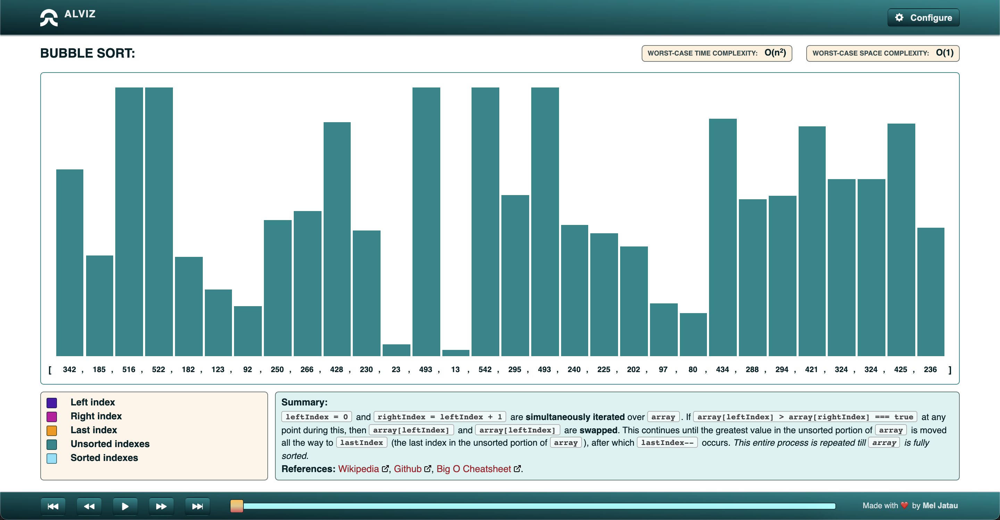

# Alviz - Sorting Algorithm Visualizer

[Visit Alviz](https://alviz.vercel.app)

Alviz is a visualizer for array sorting algorithms, built to simplify the learning process.  

## Algorithms

- [x] Quicksort
- [x] Bubble sort
- [x] Selection sort
- [x] Insertion sort
- [ ] Merge sort
- [ ] Heap sort
- [ ] Shellsort

## Features

- Explanations for each step in the sorting process
- Playback controls
- Color-coded bars representing key indexes, and a legend describing what those colors represent
- Links to external learning resources
- Mobile support
